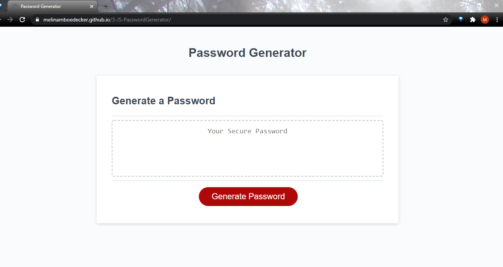

# 3-JS-PasswordGenerator
3: Java Script Password 

## Description:
This is a password generator made using Java Script.  When a user clicks the "Generate Password" button he/she will be prompted to enter the desired number of characters from 8 to 128. With a valid entry, the user will be shown a series of confirm windows to enter their choices for inclusion of lowercase letters, uppercase letters, numbers, and/or special characters. The user must choose at least one character type.   If no characters are chosen the function will run again starting with the prompt for desired number of characters.  Once the user enters a number within acceptable range and the completed confirm windows include at least one character type, the randomly generated password is shown on the screen. 

## Technologies:
HTML, CSS, Javascript

## Screenshot

## Link
https://melinamboedecker.github.io/3-JS-PasswordGenerator/

## License
Copyright (c) 2021 Melina Boedecker
Licensed under the MIT license.

